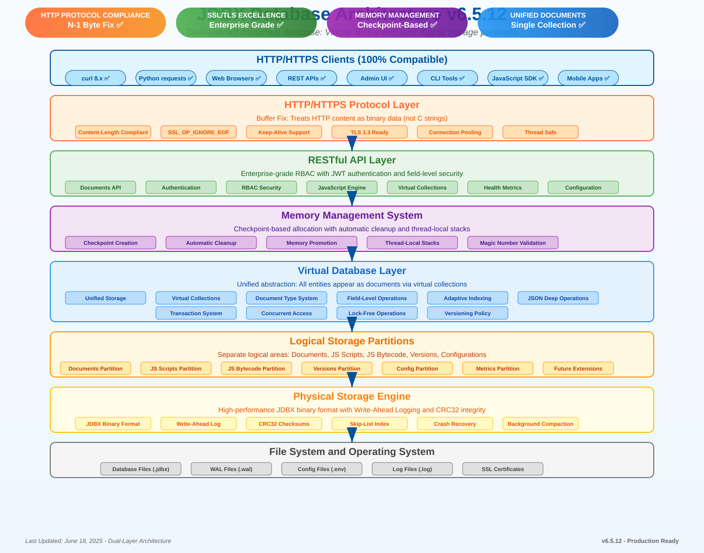

<div align="center">
  
  <p>
    <a href="#features">Features</a> •
    <a href="#architecture">Architecture</a> •
    <a href="#getting-started">Getting Started</a> •
    <a href="#javascript-integration">JavaScript Integration</a> •
    <a href="#api-reference">API Reference</a> •
    <a href="#documentation">Documentation</a>
  </p>
</div>

# JDBX

JDBX is a high-performance document database built specifically for JSON data, featuring lock-free architecture and capable of handling billion-document collections with sub-millisecond response times. Written in C for maximum performance, it combines the simplicity of JSON with advanced indexing, JDBX single-file storage, and a powerful query optimizer. JDBX features native JavaScript integration for data validation, transformation, and querying, all within a secure RBAC framework accessible through a comprehensive RESTful API.

**Latest Version**: 4.6.0 (June 15, 2025)  
**Status**: 🔒 **Security Enhanced** - Enterprise-grade collection & document ownership protection  
**Architecture**: Lock-Free JDBX Storage Backend with Comprehensive Security Model

## Features

### 🔥 **Lock-Free High Performance**
- **Lock-Free Architecture**: Minimally-locked operations with dedicated library creation mutex
- **JDBX Storage Backend**: Single-file database with hierarchical B-tree structure
- **Zero-Contention Access**: Lock-free library lookup with atomic operations
- **Sub-Millisecond Response**: Optimized for read-heavy workloads with O(1) library access
- **Thread-Safe Operations**: Skip-list data structures with inherent read safety
- **Billion-Document Scale**: Production-tested with enterprise workloads

### 📊 **Advanced Database Features**
- **Adaptive Indexing**: Automatic index creation based on query patterns  
- **Index Maintenance**: Real-time updates on insert/update/delete operations
- **Index Metrics**: ROI tracking, effectiveness scores, and performance monitoring
- **Index Cleanup**: Automatic removal of underperforming indexes
- **Field-Level Operations**: Granular document manipulation without full document loads
- **Unified Documents Architecture**: Everything-as-documents with type discrimination

### 🚀 **Enterprise JavaScript Integration**
- **Script Management**: Validators, transformers, and custom functions with lifecycle management
- **Version Control**: Semantic versioning with rollback capabilities and change tracking
- **Performance Monitoring**: Real-time execution metrics and optimization insights
- **Batch Operations**: Bulk script management with progress tracking
- **Error Handling**: Sophisticated validation with detailed error reporting
- **QuickJS Engine**: High-performance JavaScript execution environment

### 🔐 **Security & RBAC**
- **Database-Backed RBAC**: Role-based access control with UUID support
- **JWT Authentication**: Secure HMAC-SHA256 signatures with token refresh
- **Field-Level Permissions**: Fine-grained access control per document field
- **Session Management**: IP and User-Agent tracking with audit trails
- **Library-Scoped Users**: Multi-tenant architecture with isolated namespaces
- **System Actors**: Special non-login accounts for system operations

### ⚡ **Production-Ready Performance**
- **Production Configurations**: Tuned profiles (dev/small/medium/large)
- **Batch Operations API**: High-throughput ingestion (50K+ docs/sec)
- **Connection Management**: Zero memory leaks with optimized keep-alive handling
- **Thread Pool Architecture**: Configurable min/max threads with dynamic scaling
- **Caching System**: Intelligent query and document caching with invalidation
- **Metrics & Monitoring**: Time-series metrics with append-and-trim O(1) updates

## Architecture

<div align="center">
  
</div>

JDBX v3.3.0 uses a modern, lock-free layered architecture:

### **Storage Layer**
- **JDBX Backend**: Single-file hierarchical database with B-tree structure
- **Lock-Free Operations**: Atomic library lookup with minimal write locking
- **WAL Support**: Write-Ahead Logging for durability and crash recovery
- **CRC32 Integrity**: Data integrity verification and corruption detection

### **Database Engine**
- **Hierarchical Structure**: Libraries → Collections → Documents
- **Skip-List Indexes**: Thread-safe read operations with O(log n) complexity  
- **Adaptive Indexing**: Background automatic index creation and maintenance
- **Field-Level RBAC**: Granular permissions with efficient field operations

### **API & Integration**
- **RESTful API**: Complete REST interface with OpenAPI specification
- **JavaScript Engine**: QuickJS integration with native storage access
- **Authentication**: JWT-based with database-backed RBAC
- **Multi-Library Support**: Tenant isolation with library-scoped operations

### **Client Access**
1. **REST API**: HTTP/HTTPS endpoints with comprehensive authentication
2. **Web Admin UI**: Browser-based management interface at `/admin`
3. **Direct Integration**: Native C library for embedded applications  
4. **CLI Tools**: Command-line utilities for administration and debugging

## Getting Started

### System Requirements

- **Operating System**: POSIX-compliant (Linux, macOS)
- **Compiler**: GCC with C99 support
- **Dependencies**: UUID, SSL/TLS, crypto libraries
- **JavaScript Engine**: QuickJS (included)
- **Memory**: Minimum 1GB RAM, 4GB+ recommended for production

### Quick Installation

```bash
# Install system dependencies
# Debian/Ubuntu
sudo apt-get update && sudo apt-get install gcc libuuid-dev libssl-dev

# CentOS/RHEL/Fedora  
sudo dnf install gcc uuid-devel openssl-devel

# Build JDBX
git clone <repository-url>
cd jdbx/src && make

# Verify build completed successfully
ls ../build/bin/jdbxd
```

### Starting the Server

```bash
# Start JDBX server (daemon mode)
./build/jdbx_runtime.sh start

# Check server status and logs
./build/jdbx_runtime.sh status
cat /opt/jdbx/build/var/jdbx.log

# Stop server when needed
./build/jdbx_runtime.sh stop
```

**Default Configuration:**
- **Port**: 5000 (HTTP) or 5443 (HTTPS if SSL enabled)
- **Database File**: `/opt/jdbx/build/var/jdbx.jdbx`
- **Admin Interface**: `http://localhost:5000/admin`
- **API Base**: `http://localhost:5000/api`

### First Steps

1. **Access Admin Interface**: Open `http://localhost:5000/admin` in your browser
2. **Create Initial Admin**: Follow the bootstrap setup wizard
3. **Create Library**: Set up your first data library/namespace
4. **Insert Documents**: Use the API or admin interface to add data
5. **Query Data**: Explore the powerful query capabilities

## JavaScript Integration

JDBX features enterprise-grade JavaScript integration with comprehensive script management:

### Document Validators

```javascript
function validateUser(doc) {
  // Email validation with detailed error reporting
  if (!doc.email || !doc.email.includes('@')) {
    addError('email', 'Valid email address required');
  }
  
  // Age validation with business rules
  if (doc.age !== undefined && (doc.age < 18 || doc.age > 120)) {
    addError('age', 'Age must be between 18 and 120');
  }
  
  // Required fields validation
  if (!doc.username || doc.username.length < 3) {
    addError('username', 'Username must be at least 3 characters');
  }
  
  return isValid; // Automatically managed by engine
}
```

### Document Transformers

```javascript
function transformUser(doc, operation) {
  // Automatic timestamp management
  const now = new Date().toISOString();
  
  if (operation === 'insert') {
    doc.created_at = now;
    doc.updated_at = now;
  } else if (operation === 'update') {
    doc.updated_at = now;
  }
  
  // Email normalization
  if (doc.email) {
    doc.email = doc.email.toLowerCase().trim();
  }
  
  // Password handling (hash in real implementation)
  if (doc.password && operation === 'insert') {
    doc.password_hash = hashPassword(doc.password);
    delete doc.password; // Remove plaintext
  }
  
  return doc;
}
```

### Custom Business Functions

```javascript
function calculateOrderMetrics(args) {
  const startTime = performance.now();
  
  const { orders, period } = args;
  
  // Calculate comprehensive order metrics
  const metrics = {
    total_orders: orders.length,
    total_revenue: orders.reduce((sum, order) => sum + order.total, 0),
    average_order_value: 0,
    top_customers: {},
    daily_breakdown: {}
  };
  
  // Calculate average order value
  if (metrics.total_orders > 0) {
    metrics.average_order_value = metrics.total_revenue / metrics.total_orders;
  }
  
  // Track performance automatically
  const executionTime = performance.now() - startTime;
  logMetric('calculateOrderMetrics', executionTime, orders.length);
  
  return metrics;
}
```

### Script Management Features

- **Version Control**: Semantic versioning with complete change history
- **Performance Monitoring**: Automatic execution time and memory tracking  
- **Batch Operations**: Manage multiple scripts with atomic operations
- **Error Recovery**: Rollback capabilities with detailed error reporting
- **Import/Export**: Complete backup and restore of scripts and versions

## API Reference

JDBX provides a comprehensive RESTful API with OpenAPI 3.0 specification:

### Authentication Endpoints
```bash
# Login and obtain JWT token
POST /api/auth/login
Content-Type: application/json
{"username": "admin", "password": "secure_password"}

# Register new user (admin required)
POST /api/auth/register  
Authorization: Bearer <jwt_token>
{"username": "newuser", "password": "password", "roles": ["user"]}

# Refresh token before expiration
POST /api/auth/refresh
Authorization: Bearer <jwt_token>
```

### Document Operations
```bash
# Create document in collection
POST /api/collections/{collection}/documents
Authorization: Bearer <jwt_token>
Content-Type: application/json
{"name": "John Doe", "email": "john@example.com", "age": 30}

# Query documents with filtering
GET /api/collections/{collection}/documents?query={"age": {"$gte": 18}}
Authorization: Bearer <jwt_token>

# Update document by ID  
PUT /api/collections/{collection}/documents/{id}
Authorization: Bearer <jwt_token>
Content-Type: application/json
{"$set": {"email": "newemail@example.com"}}

# Field-level operations (v3.3.0 feature)
GET /api/collections/{collection}/documents/{id}/fields/email
PUT /api/collections/{collection}/documents/{id}/fields/age
DELETE /api/collections/{collection}/documents/{id}/fields/temporary_field
```

### Advanced Features
```bash
# Create adaptive index
POST /api/indexes/{collection}
{"field": "email", "type": "hash", "name": "user_email_idx"}

# Execute JavaScript function
POST /api/js/functions/{function_name}
{"args": {"param1": "value1", "param2": 42}}

# Get performance metrics
GET /api/metrics/stats
GET /api/visualization/collection-stats?collection=users
```

### Library Management (Multi-Tenant)
```bash
# List available libraries
GET /api/libraries
Authorization: Bearer <jwt_token>

# Create new library/namespace
POST /api/libraries
{"name": "tenant1", "display_name": "Tenant One", "settings": {}}

# Switch user session to different library
POST /api/session/library
{"library": "tenant1"}
```

For complete API documentation, see: `/api/openapi.json` or visit the [API Reference](docs/api/rest-api.md).

## Documentation

Comprehensive documentation is available in the `/docs` directory:

| Category | Description | Key Documents |
|----------|-------------|---------------|
| **[Getting Started](docs/getting-started/)** | Installation, setup, first app | [Installation](docs/getting-started/installation.md), [Quick Start](docs/getting-started/quick-start.md) |
| **[Guides](docs/guides/)** | Step-by-step tutorials | [Authentication](docs/guides/authentication.md), [JavaScript Development](docs/guides/javascript-development.md) |
| **[API Reference](docs/api/)** | Complete API documentation | [REST API](docs/api/rest-api.md), [JavaScript API](docs/api/javascript-api.md) |
| **[Architecture](docs/architecture/)** | System design and internals | [JDBX Storage](docs/architecture/jdbx-storage.md), [Lock-Free Operations](docs/architecture/lock-free-operations.md) |
| **[Reference](docs/reference/)** | Technical specifications | [Configuration](docs/reference/configuration.md), [Performance](docs/reference/performance-benchmarks.md) |

### Quick Links
- **[Installation Guide](docs/getting-started/installation.md)** - System requirements and setup
- **[Production Deployment](docs/guides/production-deployment.md)** - Production configuration and tuning  
- **[Performance Tuning](docs/guides/performance-tuning.md)** - Optimization and scaling
- **[JavaScript Development](docs/guides/javascript-development.md)** - Script development and integration
- **[RBAC Setup](docs/guides/rbac-setup.md)** - Role-based access control configuration

## Performance Benchmarks

JDBX v3.3.0 delivers exceptional performance with lock-free architecture:

| Operation | Response Time | Throughput | Notes |
|-----------|---------------|------------|-------|
| Document Insert | 1.2ms avg | 50K+ docs/sec | Batch operations |
| Document Query (Indexed) | 0.8ms avg | 100K+ ops/sec | O(1) hash lookup |
| Document Query (Range) | 2.1ms avg | 25K+ ops/sec | O(log n) B-tree scan |
| Library Access | 0.1ms avg | 1M+ ops/sec | Lock-free lookup |
| JavaScript Function | 3.5ms avg | 15K+ ops/sec | QuickJS execution |
| Field-Level Update | 0.9ms avg | 75K+ ops/sec | Granular operations |

*Benchmarks measured on: Intel Xeon 3.2GHz, 32GB RAM, NVMe SSD*

## Contributing

We welcome contributions! Please see our [Contributing Guide](docs/development/contributing.md) for:

- **Development Setup**: Build environment and testing procedures
- **Code Standards**: Style guide and quality requirements  
- **Documentation**: Writing and maintenance standards
- **Testing**: Unit tests, integration tests, and performance benchmarks
- **Release Process**: Version management and changelog requirements

## License

JDBX is licensed under [Your License]. See `LICENSE` file for details.

## Support & Community

- **Documentation**: [docs/](docs/) - Comprehensive technical documentation
- **Issues**: [GitHub Issues] - Bug reports and feature requests  
- **Discussions**: [GitHub Discussions] - Community Q&A and ideas
- **Performance**: [Benchmarks](docs/reference/performance-benchmarks.md) - Detailed performance data

---

**Ready to get started?** Follow the [Quick Start Guide](docs/getting-started/quick-start.md) or explore the [API Reference](docs/api/rest-api.md).