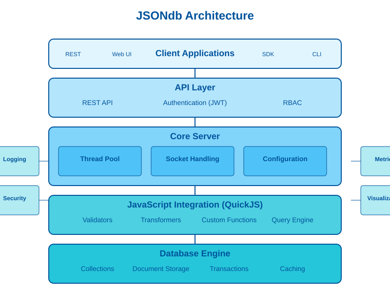

<div align="center">
  
  <p>
    <a href="#features">Features</a> •
    <a href="#architecture">Architecture</a> •
    <a href="#getting-started">Getting Started</a> •
    <a href="#javascript-integration">JavaScript Integration</a> •
    <a href="#api">API Reference</a> •
    <a href="#documentation">Documentation</a>
  </p>
</div>

## What is JSONdb?

JSONdb is a lightweight, high-performance document database built specifically for JSON data. Written in C for maximum performance, it combines the simplicity of JSON with the power of a full database system. JSONdb features native JavaScript integration for data validation, transformation, and querying, all within a secure RBAC framework accessible through a RESTful API.

## Features

- **Native JSON Document Storage**: Store, query, and manipulate JSON documents with full ACID transactions
- **JavaScript Integration**: 
  - Write validators to enforce data integrity
  - Create transformers to modify documents during operations
  - Define custom functions for complex business logic
  - Use JavaScript for powerful query expressions
- **Security First**:
  - Database-based Role-Based Access Control (RBAC)
  - JWT authentication with token refresh
  - Fine-grained permission system at multiple levels
- **High Performance**:
  - Written in C for maximum efficiency
  - Multithreaded architecture with thread pool
  - Document caching system with intelligent invalidation
  - Optimized for both read and write operations
- **RESTful API**: Complete API for database operations
- **Visualization & Metrics**: 
  - Transaction visualization for monitoring
  - Comprehensive metrics system
  - Performance analysis tools

## Architecture

<div align="center">
  
</div>

JSONdb uses a modular, layered architecture:

1. **Client Layer**: Applications interact through REST API, Web UI, SDKs, or CLI
2. **API Layer**: Handles authentication, RBAC, and exposes RESTful endpoints
3. **Core Server**: Manages threads, socket connections, and configuration
4. **JavaScript Integration**: Provides validators, transformers, custom functions, and query capabilities
5. **Database Engine**: Manages collections, documents, transactions, and caching

## Getting Started

### Requirements

- POSIX-compliant operating system (Linux, macOS)
- GCC compiler
- Development packages for UUID, SSL, and crypto libraries

### Quick Installation

```bash
# Install dependencies
# Debian/Ubuntu
sudo apt-get update
sudo apt-get install gcc libuuid-dev libssl-dev

# CentOS/RHEL
sudo yum install gcc uuid-devel openssl-devel

# Build from source
git clone https://github.com/yourusername/jsondb.git
cd jsondb
cd src && make
```

### Running the Server

```bash
# Start the server
./build/jsondb_runtime.sh start

# Check server status
./build/jsondb_runtime.sh status

# Stop the server
./build/jsondb_runtime.sh stop
```

By default, the server runs on port 5000. Access the API at `http://localhost:5000` and the admin interface at `http://localhost:5000/admin`.

## JavaScript Integration

JSONdb integrates the QuickJS JavaScript engine to extend database functionality:

### Document Validators

```javascript
function validateDocument(doc) {
  if (!doc.email || !doc.email.includes('@')) {
    addError('email', 'Invalid email format');
  }
  if (doc.age !== undefined && (doc.age < 18 || doc.age > 120)) {
    addError('age', 'Age must be between 18 and 120');
  }
  return isValid;
}
```

### Document Transformers

```javascript
function transformDocument(doc, operation) {
  if (operation === 'insert' || operation === 'update') {
    doc.updated_at = new Date().toISOString();
    doc.email = doc.email ? doc.email.toLowerCase() : null;
  }
  return doc;
}
```

### Custom Functions

```javascript
function userFunction(args) {
  const { items, tax } = args;
  const subtotal = items.reduce((sum, item) => sum + (item.price * item.quantity), 0);
  return {
    subtotal,
    tax: subtotal * (tax || 0.1),
    total: subtotal * (1 + (tax || 0.1))
  };
}
```

### JavaScript Query

```javascript
// Query active users over 30 years old
const query = `doc.status === 'active' && doc.age > 30`;
```

## API

JSONdb provides a comprehensive REST API. Here are some key endpoints:

| Endpoint | Method | Description |
|----------|--------|-------------|
| `/api/auth/login` | POST | Authenticate with credentials |
| `/api/collections` | GET | List all collections |
| `/api/collections` | POST | Create a collection |
| `/api/collections/:name/documents` | GET | Query documents |
| `/api/collections/:name/documents` | POST | Create a document |
| `/api/collections/:name/documents/:id` | GET | Get a document |
| `/api/js/validators` | POST | Register a validator |
| `/api/js/transformers` | POST | Register a transformer |
| `/api/js/functions` | POST | Register a JavaScript function |
| `/api/js/functions/:name` | POST | Execute a function |
| `/api/js/query` | POST | Execute a JavaScript query |
| `/api/transactions` | POST | Begin a transaction |
| `/api/visualization/transaction-history` | GET | View transaction history |
| `/api/metrics` | GET | Access system metrics |

For complete API documentation, see the [API Reference](docs/api/API.md).

## Documentation

- [API Reference](docs/api/API.md)
- [JavaScript API](docs/api/JAVASCRIPT_API.md)
- [RBAC System](docs/api/RBAC_API.md)
- [Transaction Management](docs/reference/TRANSACTIONS.md)
- [JavaScript Integration](docs/reference/JAVASCRIPT.md)
- [Metrics System](docs/reference/METRICS.md)
- [Project Structure](docs/architecture/project_structure.md)
- [Configuration Guide](docs/reference/CONFIGURATION.md)

## Security

JSONdb implements a comprehensive security model:

- **Authentication**: JWT-based authentication with refresh tokens
- **Authorization**: Database-based RBAC system
- **Permissions**: Four permission types (READ, WRITE, DELETE, ADMIN)
- **Resources**: Six resource types (DATABASE, COLLECTION, DOCUMENT, USER, ROLE, PERMISSION)

See the [Security Guidelines](docs/security/SECURITY_GUIDELINES.md) for best practices.

## Transaction Management

JSONdb supports ACID transactions with:

- Multiple isolation levels
- Transaction visualization
- Audit trails
- Deadlock detection and prevention
- Transaction metrics

## Performance

JSONdb is optimized for performance:

- Written in C for maximum efficiency
- Optimized memory management
- Document caching with intelligent invalidation
- Thread pool for concurrent operations
- Fine-grained locking for reduced contention

## Contribution

Contributions are welcome! See [Contributing Guidelines](docs/project/CONTRIBUTING.md) for details.

## License

This project is licensed under the MIT License - see the [LICENSE](LICENSE) file for details.