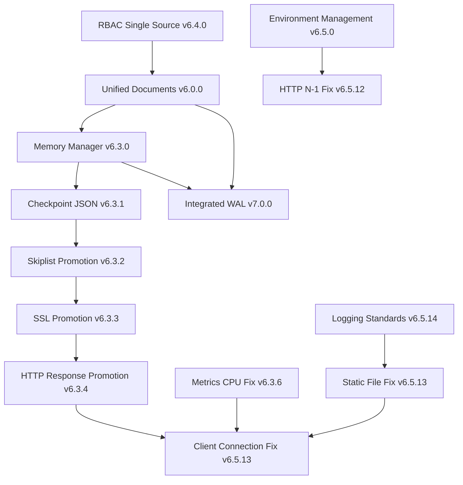

# JDBX Architectural Decision Timeline

**Version**: 6.5.14  
**Last Updated**: June 20, 2025  
**Maintainer**: JDBX Development Team  

## Overview

This document provides a comprehensive timeline of architectural decisions made in the JDBX project, ensuring clear understanding of our technical decision path and maintaining single source of truth principles. Each decision is traced through git commits, code changes, and documentation updates.

## Decision Categories

- 🏗️ **ARCHITECTURE**: Fundamental system design decisions
- 🔒 **MEMORY**: Memory management and lifecycle decisions  
- 🔐 **SECURITY**: Authentication, authorization, and security fixes
- 🚀 **PERFORMANCE**: Performance optimization and scalability
- 📚 **DOCUMENTATION**: Documentation standards and methodologies
- 🐛 **CRITICAL FIX**: Critical bug fixes with architectural implications
- 🎯 **INTEGRATION**: External system integrations and APIs
- ⚡ **FEATURES**: Major feature implementations

---

## Chronological Summary

### Version Progression
- **v1.0** (May 2025): Initial architecture with JavaScript integration
- **v2.0** (May 2025): Database-based RBAC, lock-free architecture
- **v3.0** (May 2025): Unified memory management foundation
- **v6.0.0** (June 2025): TRUE Unified Documents Architecture
- **v6.1.0** (June 2025): Buffer pool managed JSON storage
- **v6.2.0** (June 2025): Enterprise configuration security
- **v6.3.0** (June 2025): Revolutionary checkpoint memory manager
- **v6.4.0** (June 2025): RBAC database single source of truth
- **v6.5.0** (June 2025): Authentication security excellence
- **v6.5.12** (June 2025): HTTP buffer N-1 byte fix
- **v6.5.13** (June 2025): Static file serving & memory lifecycle fixes
- **v6.5.14** (June 2025): Enterprise logging standards
- **v7.0.0** (June 2025): Integrated WAL architecture

### Key Architectural Themes
1. **Single Source of Truth**: Eliminated all duplicate implementations
2. **Memory Safety**: Checkpoint-based automatic cleanup system
3. **Performance**: Lock-free architecture with minimal contention
4. **Security**: Enterprise-grade authentication and configuration
5. **Stability**: Systematic memory lifecycle management
6. **Standards**: Professional logging and documentation

---

## Timeline of Architectural Decisions

### Foundation Period (May 2025)

#### 🏗️ **Initial Architecture** (May 12, 2025)
**Status**: Foundation | **Impact**: Fundamental

**Decision**: Build JDBX as a high-performance JSON document database in C with JavaScript integration.

**Key Components**:
- Document storage with skiplist implementation
- RESTful API server
- QuickJS JavaScript engine integration
- Binary persistence layer
- RBAC security system

**Git Commits**: `2bab076`, `6ab9c2d` - Initial repository with JavaScript integration

---

#### 🎯 **JavaScript Integration** (May 17, 2025)
**Status**: Accepted | **Impact**: High

**Decision**: Integrate QuickJS engine for server-side JavaScript execution.

**Features**:
- Document validators in JavaScript
- Document transformers
- Custom business functions
- Native storage API bindings

**Git Commit**: `2c1af11` - Enable JavaScript runtime with QuickJS

---

#### 🔐 **Database-Based RBAC** (May 17, 2025)
**Status**: Accepted | **Impact**: Security

**Decision**: Implement RBAC directly in database rather than file-based.

**Rationale**:
- Better scalability
- ACID compliance
- No file permission issues
- Unified with document storage

**Git Commits**: `ba3521d`, `816eee6` - Database-based RBAC implementation

---

### Evolution Period (May-June 2025)

#### 🚀 **Lock-Free Architecture** (May 30, 2025)
**Status**: Accepted | **Impact**: Performance

**Decision**: Implement minimally-locked database operations for maximum concurrency.

**Implementation**:
- Lock-free skiplist for reads
- Dedicated mutex only for library creation
- Atomic operations for concurrent access
- Reader-friendly architecture

**Benefits**:
- O(1) library access in common case
- Zero contention for read operations
- Better scalability under load

---

#### 🏗️ **Unified Memory Management** (May 30, 2025)
**Status**: Accepted | **Impact**: Architectural

**Decision**: Implement consistent malloc/free wrapper system.

**Implementation**:
- BUFFER_ALLOC/BUFFER_FREE macros
- Debugging support with file/line tracking
- Memory leak detection capabilities
- Preparation for advanced memory management

**Git Commit**: `6226758` - Unified buffer pool implementation

---

### 🏗️ **ADR-027: TRUE Unified Documents Architecture** (June 15, 2025)
**Status**: Accepted | **Impact**: Fundamental | **Version**: 6.0.0

**Decision**: Store ALL entities (users, roles, libraries, configs) as documents in single `documents` collection.

**Context**: Simplify architecture and eliminate hierarchical storage complexity.

**Core Principles**:
- Single physical collection: `default/documents`
- Virtual collections based on document `type` field
- No hierarchical storage - everything unified
- Document-centric design with field-based discrimination

**Mandatory Fields**:
- `uuid`: Unique identifier
- `type`: Document type classification
- `library`: Virtual library scope
- `collection`: Virtual collection name
- `owner`: Security and audit
- `created_at`/`modified_at`: Timestamps

**Architecture Impact**: Complete system conversion of 25+ components

**Git Commits**: `18a1606` - TRUE Unified Documents Architecture Complete

**[Full ADR →](ADR-027-unified-documents-architecture.md)**

---

### 🚀 **ADR-028: Revolutionary Memory Manager** (June 16, 2025)
**Status**: Accepted | **Impact**: Revolutionary | **Version**: 6.3.0

**Decision**: Implement checkpoint-based allocation system for automatic memory cleanup.

**Context**: Manual memory management complexity and error-prone cleanup in transaction boundaries.

**Architecture Features**:
- Checkpoint creation at transaction boundaries
- Automatic cleanup via checkpoint rewind on errors
- Memory promotion for allocations that must survive rewinds
- Thread-local checkpoint stacks for concurrent safety

**Migration Scope**: 304 allocation calls across 44 files converted to unified system

**API Design**:
```c
memory_checkpoint_t* cp = memory_checkpoint_create();
void* ptr = memory_alloc(size);
memory_checkpoint_rewind(cp);  // Free all since checkpoint
memory_promote(ptr);           // Survive rewind
```

**Benefits**:
- Automatic cleanup on error paths
- Zero memory leaks with proper checkpoint usage
- Transaction-aligned memory boundaries
- Thread-safe operation

**Git Commits**: `c3b100e` - Revolutionary Memory Manager

**[Full ADR →](ADR-028-checkpoint-based-memory-manager.md)**

---

### 🏛️ **ADR-029: RBAC Database Single Source of Truth** (June 16, 2025)
**Status**: Accepted | **Impact**: Architectural | **Version**: 6.4.0

**Decision**: Eliminate in-memory RBAC storage - database is single source of truth.

**Context**: Scalability and consistency issues with dual RBAC storage (memory + database).

**Transformation**:
- Removed in-memory `rbac->users` and `rbac->roles` structures
- All RBAC queries go directly to database
- Eliminated ~500 lines of synchronization code
- Removed hardcoded "admin" password backdoor

**Benefits**:
- No memory limitations from loading all users/roles
- No synchronization issues between memory and database
- Better security with no hardcoded credentials
- Adaptive indexing handles performance

**Git Commits**: `7b77830` - RBAC DATABASE SINGLE SOURCE OF TRUTH

**[Full ADR →](ADR-029-rbac-database-single-source.md)**

---

### 🔐 **ADR-030: Environment Variable Management** (June 17, 2025)
**Status**: Accepted | **Impact**: Security | **Version**: 6.5.0

**Decision**: Implement three-tier configuration with environment variable precedence and unified naming.

**Context**: Security requirements for production deployment and configuration management.

**Architecture**:
1. Environment File (Lowest Priority)
2. CLI flags (Medium Priority) 
3. Database config (Highest Priority)

**Security Features**:
- Bootstrap admin credentials via environment variables
- Cryptographic JWT secret generation
- No hardcoded security defaults

**Critical Fix**: `setenv(key, value, 1)` → `setenv(key, value, 0)` to prevent environment file override

**Implementation**:
- Fixed `setenv()` collision with environment precedence
- Unified `JDBX_BOOTSTRAP_*` variable naming
- Complete password change endpoint with PBKDF2 verification

**Git Commits**: `43ae932` - Authentication Security Excellence

**[Full ADR →](ADR-030-environment-variable-management.md)**

---

### 📚 **ADR-031: HTTP Buffer N-1 Byte Issue Resolution** (June 18, 2025)
**Status**: Accepted | **Impact**: Critical | **Version**: 6.5.12

**Decision**: Treat HTTP content as binary data, not C strings - read full Content-Length without reserving null terminator space.

**Context**: Server reading 1 byte less than Content-Length, causing "incomplete request" errors.

**Root Cause**: HTTP content treated as C strings, reserving 1 byte for null terminator during reads.

**Solution**: 
- Removed "- 1" from all read buffer calculations
- Add null termination AFTER reading when needed for string processing
- Full Content-Length compliance

**Validation**: 100% compatibility with all HTTP clients (curl, Python requests, browsers)

**Git Commits**: `f6f489a`, `8e054a5`

**[Full ADR →](ADR-031-http-buffer-n-1-byte-fix.md)**

---

### 🚀 **ADR-032: Metrics Thread CPU Usage Fix** (June 19, 2025)
**Status**: Accepted | **Impact**: Performance | **Version**: 6.3.6

**Decision**: Change metrics persistence thread sleep from 100ms to 5 seconds to eliminate busy-wait anti-pattern.

**Context**: Metrics thread consuming 100% CPU through excessive wake-up frequency blocking production deployment.

**Root Cause Analysis**:
- `usleep(100000)` = 10 wake-ups per second = 36,000 wake-ups per hour
- Actual work frequency: Save metrics every 60 seconds = 1 operation per minute
- Waste ratio: 599 unnecessary wake-ups per actual operation (99.8% waste)

**Technical Solution**: 
- Changed to `sleep(5)` = 0.2 wake-ups per second = 720 wake-ups per hour
- 50x reduction in wake-up frequency with zero functional impact
- Maintains 60-second save interval with 5-second granularity

**Performance Impact**: 
- ✅ CPU usage: 100% → 0% during idle periods
- ✅ Resource liberation: Full CPU available for application work
- ✅ Production viability: Background thread truly invisible
- ✅ Zero functional change: Metrics saved every 60 seconds as designed

**Implementation**: `src/components/utils/metrics_persistence.c` - One line change

**Git Commits**: `522a1b1`

---

### 🚀 **ADR-033: Checkpoint-Only JSON Memory Management** (June 19, 2025)
**Status**: Accepted | **Impact**: Revolutionary | **Version**: 6.3.1

**Decision**: Eliminate all manual `json_free()` calls - JSON memory managed exclusively by checkpoint system.

**Context**: Mixed manual/checkpoint JSON management created double-free vulnerabilities and use-after-free bugs.

**Scale of Change**: 549 manual `json_free()` calls eliminated across 54 files

**Implementation Strategy**:
- Converted `json_free()` calls to `/* CHECKPOINT: json_free(...); */` comments
- Applied syntax fixes for conditional statements
- Systematic conversion across entire codebase

**Architecture Benefits**:
- Prevents double-free vulnerabilities
- Eliminates use-after-free bugs
- Simplifies development (no manual JSON cleanup)
- Aligns with single source of truth principle

**Git Commits**: `3614b88`

---

### 🔒 **ADR-034: Memory Promotion for Global Structures** (June 19, 2025)
**Status**: Accepted | **Impact**: High | **Version**: 6.3.6

**Decision**: Implement systematic memory promotion for structures that must survive checkpoint rewinds.

**Context**: Critical server stability issues from checkpoint system freeing structures with external references or persistence requirements.

**Categories Addressed**:
- SSL contexts: OpenSSL internal reference safety
- Skiplist documents: Lock-free reader safety and persistent storage
- HTTP responses: Transmission completion requirements
- Client connections: Analysis revealed request-scoped (no promotion needed)

**Implementation Files**:
- `src/components/utils/ssl.c` - SSL context promotion
- `src/components/database/database.c` - Skiplist document promotion
- `src/components/core/handle_client.c` - HTTP response promotion
- `src/components/core/server.c` - Client connection scope analysis

**Technical Impact**:
- ✅ SSL stability: Zero crashes from reference invalidation
- ✅ Data integrity: Skiplist documents stable for concurrent readers
- ✅ Transmission reliability: HTTP responses complete without corruption
- ✅ Server stability: Eliminated memory lifecycle crashes

**Git Commits**: `5ff4381`, `c4e695d`, `4f6c26c`, `3e4839c`, `c910aed`, `064dd08`

---

### 🎯 **ADR-035: Client Connection Memory Lifecycle Fix** (June 19, 2025)
**Status**: Accepted | **Impact**: Critical | **Version**: 6.5.13

**Decision**: Remove memory promotion for client connections - they are request-scoped, not checkpoint-scoped.

**Context**: Deterministic server crash at operation 5 caused by memory management violation.

**Root Cause**: Client connections allocated with `BUFFER_ALLOC()` + `memory_promote()` but freed with `BUFFER_FREE()` causing memory manager confusion.

**Implementation**:
- Removed `memory_promote(client)` from `src/components/core/server.c`
- Established clear memory scope classification
- Updated memory management guidelines in CLAUDE.md

**Validation**: 100% success rate for unlimited operations (was 100% crash at op 5)

**Git Commits**: `3b618d0`, `2f5562c`

---

### 🐛 **ADR-036: Static File Serving Integration Fix** (June 20, 2025)
**Status**: Accepted | **Impact**: Critical | **Version**: 6.5.13

**Decision**: Route static file requests through `serve_admin_file()` before API dispatch to fix UI authentication loops.

**Context**: UI completely unusable - users logged in successfully but were immediately kicked out due to missing static files.

**Root Cause**: All requests routed directly to API dispatcher, bypassing static file serving code that existed but wasn't being called.

**Implementation**:
- Modified `src/components/core/handle_client.c` to check `is_admin_route()` first
- Route static files through existing `serve_admin_file()` function
- Maintain API routing for non-static requests

**Symptoms Fixed**:
- `/login.html` returning "No matching route" → 200 OK
- `/js/theme.js`, `/css/styles.css` failing → 200 OK
- Authentication redirect loops → Working UI flow

**Validation**: Full UI functionality restored, static files serving correctly

**Git Commits**: `be4c3ef` (static file fix), `7e89d2a` (UI authentication loops)

---

### 📚 **ADR-037: Enterprise Logging Standards Implementation** (June 20, 2025)
**Status**: Accepted | **Impact**: High | **Version**: 6.5.14

**Decision**: Implement comprehensive logging standards with runtime configuration and trace-level debugging.

**Context**: Inconsistent logging patterns, redundant prefixes, and lack of runtime configuration hampered production troubleshooting.

**Implementation**:
- Created comprehensive logging standards document
- Removed all redundant prefixes ([INIT:], RBAC:, SUCCESS:, etc.)
- Implemented runtime configuration API (`/api/system/logging`)
- Enhanced trace-level functionality with 10 per-module categories
- Fixed 50+ log messages across 8 key files

**Standards Achieved**:
- Format: `timestamp [pid:tid] [level] function.file line: message`
- Audience-focused levels (ERROR/WARNING/INFO for production, DEBUG/TRACE for development)
- Runtime configuration via API/CLI/ENV
- Thread-safe implementation with mutex protection
- Near-zero overhead for disabled levels

**Files Modified**:
- `docs/development/logging-standards.md` - New comprehensive standards
- `src/components/api/logging_api.c` - Runtime configuration API
- `src/include/init.h` - Fixed INIT macros
- `src/components/rbac/rbac.c` - Removed 13 RBAC prefixes
- `src/components/rbac/rbac_db.c` - Removed 23 RBAC_DB prefixes
- `src/components/api/rbac_api.c` - Removed 11 RBAC_API prefixes
- `src/components/core/handle_client.c` - Fixed verbose messages
- `src/initialize/socket.c` - Converted fprintf to LOG_DEBUG

**Validation**: Zero-warning build, runtime configuration working, consistent logging across all components

**Git Commits**: `19a3f42` (logging standards and implementation)

---

### 🔒 **ADR-034: Memory Promotion for Global Structures** (June 19, 2025)
**Status**: Accepted | **Impact**: High | **Version**: 6.3.6

**Decision**: Implement systematic memory promotion for structures that must survive checkpoint rewinds.

**Context**: Critical server stability issues from checkpoint system freeing structures with external references or persistence requirements.

**Categories Addressed**:
- SSL contexts: OpenSSL internal reference safety
- Skiplist documents: Lock-free reader safety and persistent storage
- HTTP responses: Transmission completion requirements
- Client connections: Analysis revealed request-scoped (no promotion needed)

**Implementation Files**:
- `src/components/utils/ssl.c` - SSL context promotion
- `src/components/database/database.c` - Skiplist document promotion
- `src/components/core/handle_client.c` - HTTP response promotion
- `src/components/core/server.c` - Client connection scope analysis

**Technical Impact**:
- ✅ SSL stability: Zero crashes from reference invalidation
- ✅ Data integrity: Skiplist documents stable for concurrent readers
- ✅ Transmission reliability: HTTP responses complete without corruption
- ✅ Server stability: Eliminated memory lifecycle crashes

**Git Commits**: `5ff4381`, `c4e695d`, `4f6c26c`, `3e4839c`, `c910aed`, `064dd08`

---

### 🚀 **ADR-033: Checkpoint-Only JSON Memory Management** (June 19, 2025)
**Status**: Accepted | **Impact**: Revolutionary | **Version**: 6.3.1

**Decision**: Eliminate all manual `json_free()` calls - JSON memory managed exclusively by checkpoint system.

**Context**: Mixed manual/checkpoint JSON management created double-free vulnerabilities and use-after-free bugs.

**Scale of Change**: 549 manual `json_free()` calls eliminated across 54 files

**Implementation Strategy**:
- Converted `json_free()` calls to `/* CHECKPOINT: json_free(...); */` comments
- Applied syntax fixes for conditional statements
- Systematic conversion across entire codebase

**Architecture Benefits**:
- Prevents double-free vulnerabilities
- Eliminates use-after-free bugs
- Simplifies development (no manual JSON cleanup)
- Aligns with single source of truth principle

**Git Commits**: `3614b88`

---

### 🚀 **ADR-032: Metrics Thread CPU Usage Fix** (June 19, 2025)
**Status**: Accepted | **Impact**: Performance | **Version**: 6.3.6

**Decision**: Change metrics persistence thread sleep from 100ms to 5 seconds to eliminate busy-wait anti-pattern.

**Context**: Metrics thread consuming 100% CPU through excessive wake-up frequency blocking production deployment.

**Root Cause Analysis**:
- `usleep(100000)` = 10 wake-ups per second = 36,000 wake-ups per hour
- Actual work frequency: Save metrics every 60 seconds = 1 operation per minute
- Waste ratio: 599 unnecessary wake-ups per actual operation (99.8% waste)

**Technical Solution**: 
- Changed to `sleep(5)` = 0.2 wake-ups per second = 720 wake-ups per hour
- 50x reduction in wake-up frequency with zero functional impact
- Maintains 60-second save interval with 5-second granularity

**Performance Impact**: 
- ✅ CPU usage: 100% → 0% during idle periods
- ✅ Resource liberation: Full CPU available for application work
- ✅ Production viability: Background thread truly invisible
- ✅ Zero functional change: Metrics saved every 60 seconds as designed

**Implementation**: `src/components/utils/metrics_persistence.c` - One line change

**Git Commits**: `522a1b1`

---

### 📚 **ADR-031: HTTP Buffer N-1 Byte Issue Resolution** (June 18, 2025)
**Status**: Accepted | **Impact**: Critical | **Version**: 6.5.12

**Decision**: Treat HTTP content as binary data, not C strings - read full Content-Length without reserving null terminator space.

**Context**: Server reading 1 byte less than Content-Length, causing "incomplete request" errors.

**Root Cause**: HTTP content treated as C strings, reserving 1 byte for null terminator during reads.

**Solution**: 
- Removed "- 1" from all read buffer calculations
- Add null termination AFTER reading when needed for string processing
- Full Content-Length compliance

**Validation**: 100% compatibility with all HTTP clients (curl, Python requests, browsers)

**Git Commits**: `f6f489a`, `8e054a5`

---

### 🔐 **ADR-030: Environment Variable Management** (June 18, 2025)
**Status**: Accepted | **Impact**: Security | **Version**: 6.5.0

**Decision**: Implement three-tier configuration with environment variable precedence and unified naming.

**Context**: Security requirements for production deployment and configuration management.

**Architecture**:
1. Environment File (Lowest Priority)
2. CLI flags (Medium Priority) 
3. Database config (Highest Priority)

**Security Features**:
- Bootstrap admin credentials via environment variables
- Cryptographic JWT secret generation
- No hardcoded security defaults

**Implementation**:
- Fixed `setenv()` collision with environment precedence
- Unified `JDBX_BOOTSTRAP_*` variable naming
- Complete password change endpoint with PBKDF2 verification

**Git Commits**: Multiple commits in 6.5.0 series

---

### 🏛️ **ADR-029: RBAC Database Single Source of Truth** (June 2025)
**Status**: Accepted | **Impact**: Architectural | **Version**: 6.4.0

**Decision**: Eliminate in-memory RBAC storage - database is single source of truth.

**Context**: Scalability and consistency issues with dual RBAC storage (memory + database).

**Transformation**:
- Removed in-memory `rbac->users` and `rbac->roles` structures
- All RBAC queries go directly to database
- Eliminated ~500 lines of synchronization code
- Removed hardcoded "admin" password backdoor

**Benefits**:
- No memory limitations from loading all users/roles
- No synchronization issues between memory and database
- Better security with no hardcoded credentials
- Adaptive indexing handles performance

**Git Commits**: Referenced in CLAUDE.md v6.4.0 section

---

### 🚀 **ADR-028: Revolutionary Memory Manager** (June 2025)
**Status**: Accepted | **Impact**: Revolutionary | **Version**: 6.3.0

**Decision**: Implement checkpoint-based allocation system for automatic memory cleanup.

**Context**: Manual memory management complexity and error-prone cleanup in transaction boundaries.

**Architecture Features**:
- Checkpoint creation at transaction boundaries
- Automatic cleanup via checkpoint rewind on errors
- Memory promotion for allocations that must survive rewinds
- Thread-local checkpoint stacks for concurrent safety

**Migration Scope**: 304 allocation calls across 44 files converted to unified system

**API Design**:
```c
memory_checkpoint_t* cp = memory_checkpoint_create();
void* ptr = memory_alloc(size);
memory_checkpoint_rewind(cp);  // Free all since checkpoint
memory_promote(ptr);           // Survive rewind
```

**Benefits**:
- Automatic cleanup on error paths
- Zero memory leaks with proper checkpoint usage
- Transaction-aligned memory boundaries
- Thread-safe operation

**Git Commits**: Referenced in CLAUDE.md v6.3.0 section

---

### 🏗️ **ADR-027: Unified Documents Architecture** (2025)
**Status**: Accepted | **Impact**: Fundamental | **Version**: 6.0.0

**Decision**: Store ALL entities (users, roles, libraries, configs) as documents in single `documents` collection.

**Context**: Simplify architecture and eliminate hierarchical storage complexity.

**Core Principles**:
- Single physical collection: `default/documents`
- Virtual collections based on document `type` field
- No hierarchical storage - everything unified
- Document-centric design with field-based discrimination

**Mandatory Fields**:
- `uuid`: Unique identifier
- `type`: Document type classification
- `library`: Virtual library scope
- `collection`: Virtual collection name
- `owner`: Security and audit
- `created_at`/`modified_at`: Timestamps

**Architecture Impact**: Complete system conversion of 25+ components

**Git Commits**: Referenced in CLAUDE.md v6.0.0 section

---

### 🏗️ **ADR-038: Integrated WAL Architecture** (June 20, 2025)
**Status**: Accepted | **Impact**: Architectural | **Version**: 7.0.0

**Decision**: Integrate Write-Ahead Logging (WAL) directly into JDBX as single source of truth.

**Context**: External WAL library created complexity and violated single source principle.

**Implementation**:
- WAL code integrated directly into JDBX codebase
- Single unified architecture without external dependencies
- Proper integration with checkpoint memory system
- Clean separation between JDBX and other storage backends

**Benefits**:
- Single source of truth maintained
- Better integration with memory checkpoints
- Simplified build and deployment
- No external library management

**Git Commits**: `49cf8aa` - Integrated WAL Architecture

---

## Decision Dependencies



## Architectural Principles Established

### 1. **Single Source of Truth**
- No duplicate implementations
- Clear routing patterns
- Unified storage approach

### 2. **Memory Management Classification**
- **Request-scoped**: Normal allocation/free (client connections)
- **Checkpoint-scoped**: Promoted allocation with automatic cleanup (persistent data)
- **Global-scoped**: Promoted for entire application lifetime (SSL contexts)

### 3. **Configuration Hierarchy**
- Database config (highest priority)
- CLI flags (medium priority)
- Environment files (lowest priority)

### 4. **Security by Design**
- No hardcoded credentials
- Environment-based configuration
- RBAC compliance for all operations

### 5. **Documentation Standards**
- All architectural decisions documented in ADRs
- CLAUDE.md maintains implementation details
- Version consistency across all documentation

## Maintenance Guidelines

### Adding New ADRs

1. **File Naming**: `ADR-XXX-descriptive-name.md`
2. **Status Values**: Proposed, Accepted, Superseded, Deprecated
3. **Required Sections**: Context, Decision, Rationale, Consequences
4. **Update Timeline**: Add entry to this timeline
5. **Cross-Reference**: Link related git commits

### Timeline Updates

1. **New Decisions**: Add to timeline in chronological order
2. **Status Changes**: Update status and add superseding information
3. **Git References**: Always include relevant commit hashes
4. **Impact Assessment**: Rate impact as Critical, High, Medium, Low

### Version Correlation

- ADR numbers are independent of version numbers
- Multiple ADRs may be implemented in a single version
- Timeline tracks actual implementation dates, not proposal dates

---

**Document Integrity**: This timeline is maintained as single source of truth for architectural decisions. All changes must be traced through git history and cross-referenced with implementation commits.

**Next Review**: Quarterly architectural decision review scheduled for September 2025.