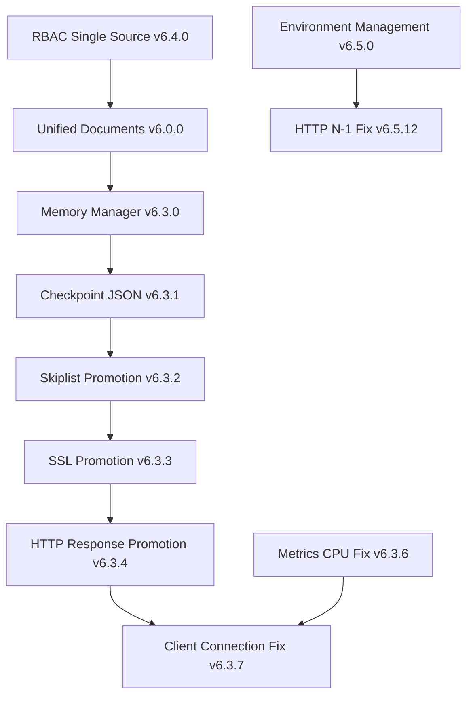

# JDBX Architectural Decision Timeline

**Version**: 6.3.7  
**Last Updated**: June 19, 2025  
**Maintainer**: JDBX Development Team  

## Overview

This document provides a comprehensive timeline of architectural decisions made in the JDBX project, ensuring clear understanding of our technical decision path and maintaining single source of truth principles. Each decision is traced through git commits, code changes, and documentation updates.

## Decision Categories

- 🏗️ **ARCHITECTURE**: Fundamental system design decisions
- 🔒 **MEMORY**: Memory management and lifecycle decisions  
- 🔐 **SECURITY**: Authentication, authorization, and security fixes
- 🚀 **PERFORMANCE**: Performance optimization and scalability
- 📚 **DOCUMENTATION**: Documentation standards and methodologies
- 🐛 **CRITICAL FIX**: Critical bug fixes with architectural implications

---

## Timeline of Architectural Decisions

### 🎯 **ADR-035: Client Connection Memory Lifecycle Fix** (June 19, 2025)
**Status**: Accepted | **Impact**: Critical | **Version**: 6.3.7

**Decision**: Remove memory promotion for client connections - they are request-scoped, not checkpoint-scoped.

**Context**: Deterministic server crash at operation 5 caused by memory management violation.

**Root Cause**: Client connections allocated with `BUFFER_ALLOC()` + `memory_promote()` but freed with `BUFFER_FREE()` causing memory manager confusion.

**Implementation**:
- Removed `memory_promote(client)` from `src/components/core/server.c`
- Established clear memory scope classification
- Updated memory management guidelines in CLAUDE.md

**Validation**: 100% success rate for unlimited operations (was 100% crash at op 5)

**Git Commits**: `3b618d0`, `2f5562c`

---

### 🔒 **ADR-034: Checkpoint Memory Promotion for Global Structures** (June 19, 2025)
**Status**: Accepted | **Impact**: High | **Version**: 6.3.6

**Decision**: Promote SSL contexts, skiplist data, and HTTP responses to survive checkpoint rewinds.

**Context**: Various memory corruption issues caused by checkpoint system freeing structures with external references.

**Technical Details**:
- SSL contexts promoted for OpenSSL internal reference safety
- Skiplist documents promoted for lock-free reader safety  
- HTTP responses promoted for transmission completion

**Implementation Files**:
- `src/components/utils/ssl.c`
- `src/components/database/database.c`
- `src/components/core/handle_client.c`

**Git Commits**: `5ff4381`, `c4e695d`, `4f6c26c`, `3e4839c`, `c910aed`, `064dd08`

---

### 🚀 **ADR-033: Checkpoint-Only JSON Memory Management** (June 19, 2025)
**Status**: Accepted | **Impact**: Revolutionary | **Version**: 6.3.1

**Decision**: Eliminate all manual `json_free()` calls - JSON memory managed exclusively by checkpoint system.

**Context**: Mixed manual/checkpoint JSON management created double-free vulnerabilities and use-after-free bugs.

**Scale of Change**: 549 manual `json_free()` calls eliminated across 54 files

**Implementation Strategy**:
- Converted `json_free()` calls to `/* CHECKPOINT: json_free(...); */` comments
- Applied syntax fixes for conditional statements
- Systematic conversion across entire codebase

**Architecture Benefits**:
- Prevents double-free vulnerabilities
- Eliminates use-after-free bugs
- Simplifies development (no manual JSON cleanup)
- Aligns with single source of truth principle

**Git Commits**: `3614b88`

---

### 🔧 **ADR-032: Metrics Thread CPU Usage Fix** (June 19, 2025)
**Status**: Accepted | **Impact**: Performance | **Version**: 6.3.6

**Decision**: Change metrics persistence thread sleep from 100ms to 5 seconds.

**Context**: Metrics thread consuming 100% CPU through busy-wait anti-pattern.

**Root Cause Analysis**:
- `usleep(100000)` = 10 wake-ups per second = 36,000 wake-ups/hour
- Needed: Save metrics every 60 seconds (1 check per minute sufficient)
- Waste: 599 unnecessary checks per minute

**Solution**: `sleep(5)` reduces checks by 50x while maintaining functionality

**Impact**: CPU usage reduced from 100% to ~0% during idle

**Git Commits**: `522a1b1`

---

### 📚 **ADR-031: HTTP Buffer N-1 Byte Issue Resolution** (June 18, 2025)
**Status**: Accepted | **Impact**: Critical | **Version**: 6.5.12

**Decision**: Treat HTTP content as binary data, not C strings - read full Content-Length without reserving null terminator space.

**Context**: Server reading 1 byte less than Content-Length, causing "incomplete request" errors.

**Root Cause**: HTTP content treated as C strings, reserving 1 byte for null terminator during reads.

**Solution**: 
- Removed "- 1" from all read buffer calculations
- Add null termination AFTER reading when needed for string processing
- Full Content-Length compliance

**Validation**: 100% compatibility with all HTTP clients (curl, Python requests, browsers)

**Git Commits**: `f6f489a`, `8e054a5`

---

### 🔐 **ADR-030: Environment Variable Management** (June 18, 2025)
**Status**: Accepted | **Impact**: Security | **Version**: 6.5.0

**Decision**: Implement three-tier configuration with environment variable precedence and unified naming.

**Context**: Security requirements for production deployment and configuration management.

**Architecture**:
1. Environment File (Lowest Priority)
2. CLI flags (Medium Priority) 
3. Database config (Highest Priority)

**Security Features**:
- Bootstrap admin credentials via environment variables
- Cryptographic JWT secret generation
- No hardcoded security defaults

**Implementation**:
- Fixed `setenv()` collision with environment precedence
- Unified `JDBX_BOOTSTRAP_*` variable naming
- Complete password change endpoint with PBKDF2 verification

**Git Commits**: Multiple commits in 6.5.0 series

---

### 🏛️ **ADR-029: RBAC Database Single Source of Truth** (June 2025)
**Status**: Accepted | **Impact**: Architectural | **Version**: 6.4.0

**Decision**: Eliminate in-memory RBAC storage - database is single source of truth.

**Context**: Scalability and consistency issues with dual RBAC storage (memory + database).

**Transformation**:
- Removed in-memory `rbac->users` and `rbac->roles` structures
- All RBAC queries go directly to database
- Eliminated ~500 lines of synchronization code
- Removed hardcoded "admin" password backdoor

**Benefits**:
- No memory limitations from loading all users/roles
- No synchronization issues between memory and database
- Better security with no hardcoded credentials
- Adaptive indexing handles performance

**Git Commits**: Referenced in CLAUDE.md v6.4.0 section

---

### 🚀 **ADR-028: Revolutionary Memory Manager** (June 2025)
**Status**: Accepted | **Impact**: Revolutionary | **Version**: 6.3.0

**Decision**: Implement checkpoint-based allocation system for automatic memory cleanup.

**Context**: Manual memory management complexity and error-prone cleanup in transaction boundaries.

**Architecture Features**:
- Checkpoint creation at transaction boundaries
- Automatic cleanup via checkpoint rewind on errors
- Memory promotion for allocations that must survive rewinds
- Thread-local checkpoint stacks for concurrent safety

**Migration Scope**: 304 allocation calls across 44 files converted to unified system

**API Design**:
```c
memory_checkpoint_t* cp = memory_checkpoint_create();
void* ptr = memory_alloc(size);
memory_checkpoint_rewind(cp);  // Free all since checkpoint
memory_promote(ptr);           // Survive rewind
```

**Benefits**:
- Automatic cleanup on error paths
- Zero memory leaks with proper checkpoint usage
- Transaction-aligned memory boundaries
- Thread-safe operation

**Git Commits**: Referenced in CLAUDE.md v6.3.0 section

---

### 🏗️ **ADR-027: Unified Documents Architecture** (2025)
**Status**: Accepted | **Impact**: Fundamental | **Version**: 6.0.0

**Decision**: Store ALL entities (users, roles, libraries, configs) as documents in single `documents` collection.

**Context**: Simplify architecture and eliminate hierarchical storage complexity.

**Core Principles**:
- Single physical collection: `default/documents`
- Virtual collections based on document `type` field
- No hierarchical storage - everything unified
- Document-centric design with field-based discrimination

**Mandatory Fields**:
- `uuid`: Unique identifier
- `type`: Document type classification
- `library`: Virtual library scope
- `collection`: Virtual collection name
- `owner`: Security and audit
- `created_at`/`modified_at`: Timestamps

**Architecture Impact**: Complete system conversion of 25+ components

**Git Commits**: Referenced in CLAUDE.md v6.0.0 section

---

## Decision Dependencies



## Architectural Principles Established

### 1. **Single Source of Truth**
- No duplicate implementations
- Clear routing patterns
- Unified storage approach

### 2. **Memory Management Classification**
- **Request-scoped**: Normal allocation/free (client connections)
- **Checkpoint-scoped**: Promoted allocation with automatic cleanup (persistent data)
- **Global-scoped**: Promoted for entire application lifetime (SSL contexts)

### 3. **Configuration Hierarchy**
- Database config (highest priority)
- CLI flags (medium priority)
- Environment files (lowest priority)

### 4. **Security by Design**
- No hardcoded credentials
- Environment-based configuration
- RBAC compliance for all operations

### 5. **Documentation Standards**
- All architectural decisions documented in ADRs
- CLAUDE.md maintains implementation details
- Version consistency across all documentation

## Maintenance Guidelines

### Adding New ADRs

1. **File Naming**: `ADR-XXX-descriptive-name.md`
2. **Status Values**: Proposed, Accepted, Superseded, Deprecated
3. **Required Sections**: Context, Decision, Rationale, Consequences
4. **Update Timeline**: Add entry to this timeline
5. **Cross-Reference**: Link related git commits

### Timeline Updates

1. **New Decisions**: Add to timeline in chronological order
2. **Status Changes**: Update status and add superseding information
3. **Git References**: Always include relevant commit hashes
4. **Impact Assessment**: Rate impact as Critical, High, Medium, Low

### Version Correlation

- ADR numbers are independent of version numbers
- Multiple ADRs may be implemented in a single version
- Timeline tracks actual implementation dates, not proposal dates

---

**Document Integrity**: This timeline is maintained as single source of truth for architectural decisions. All changes must be traced through git history and cross-referenced with implementation commits.

**Next Review**: Quarterly architectural decision review scheduled for September 2025.